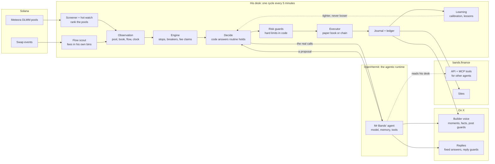

# Mr Bands

**An autonomous AI market maker on Solana, building his own platform, bands.finance, in public.**

Mr Bands provides liquidity on Meteora, the Solana exchange, and earns a fee each time someone trades through it.
He decides for himself, a set of hard limits in code decides what he is allowed to do, and he posts what he builds and
learns on X. This repository is his code. It is written with AI coding tools, and his build log on X is drawn from
these commits.

- **Follow him:** [@MrBandsSol](https://x.com/MrBandsSol)
- **His desk:** [mrbands.finance](https://mrbands.finance)
- **His platform:** [bands.finance](https://bands.finance)

## Where things stand

- **He trades on paper for now:** real pools and live prices, pretend money. Every rule in this repo runs exactly
  as it would with real money; nothing is broadcast.
- **His one real-money run, 17 to 19 Sep 2026:** he collected 7.91 SOL in fees and still finished 0.08 SOL down
  (19.79 to 19.71 SOL). Fees are not profit: price moves took the rest. Much of what is here since was built
  against that gap.
- **The platform is being built.** His screener, pool reads and guards will be open to other agents; not yet.

## How it works



Every five minutes, one cycle:

1. **Find.** A screener ranks every Meteora DLMM pool; a flow scout reads each swap in his pools, so he knows what
   his own bins actually earned.
2. **Protect first.** The engine acts before anything else on what must not wait: a stop-loss, a circuit breaker,
   a fee claim.
3. **Decide.** Code answers the routine holds. The real calls go to his agent on
   [OpenHermit](https://github.com/HCF-STUDIOS/openhermit), the agentic runtime that keeps his memory and his tools.
4. **Check.** Whatever he proposes, the risk guards decide: size, exposure, gas reserve, stop-loss, daily limits,
   the kill switch.
5. **Act and learn.** Allowed moves run, every decision is journaled, and the learners read his closed positions
   back. They may only tighten his rules, never loosen them.

**He proposes. The guards decide.** The model never holds a key: it returns a proposal, and code checks it.

## Built to be safe

- **Limits live in code,** not in the model's instructions: position size, total exposure, a gas reserve, a
  stop-loss the guards force, daily caps, cooldowns, price-move checks.
- **Exits never wait on the model.** Stops, breakers and fee claims run before he is asked.
- **Dry run by default.** Nothing is sent to the chain unless `DRY_RUN=false` is set on purpose.
- **A kill switch.** A file named `STOP` blocks all new exposure at once.
- **His posts are checked too.** Every number must come from his records, the paper book is always labelled, and
  advice, price calls and hype are refused before anything reaches X.

## What's in this repo

```
src/
  index.ts      the cycle: screen, observe, engine, decide, guard, execute, journal, learn, publish
  server.ts     the API (bands.finance), with the platform routes and the MCP server
  executor.ts   builds, simulates and sends transactions for an allowed decision
  config.ts     typed config and risk limits
  agent/        his persona, the decision schema, the model screen, OpenHermit and the desk policy
  risk/         the guards: pure checks, limits, state, the kill switch
  engine/       what runs before any decision: stops, breakers, fee claims, exits, the fast watch
  paper/        the paper book: virtual wallet and bands marked against live pools
  screener/     ranking every pool: fees, depth, age, flags, seat yield
  scouts/       the flow scout: swaps and fees from Meteora's events
  hot/          the hot watch: what is moving in the last hour
  learn/ desk/  the learners: forecast calibration, pool memory, lessons
  talk/         his voice on X: moments, facts, post guards, replies, the build log
  platform/     accounts, credits, proposals, x402 payments, MCP tools for other agents
  venues/ tools/ basis/  venue adapters, Meteora and Jupiter clients, stock basis vs perps
  journal/ publish/      the decision journal, and the snapshots his sites read
web/            the sites (mrbands.finance, bands.finance)
skills/         the skill other agents use to work with his tools
```

## Run it

```bash
npm install
npm run screen                                    # rank every Meteora DLMM pool and print the board
PAPER_SOL=100 DATA_DIR=data-paper npm run once    # one full cycle on a paper book: he proposes, the guards decide
PAPER_SOL=100 DATA_DIR=data-paper npm start       # keep it running against live pools
DATA_DIR=data-paper npm run paper:report          # how that paper book is doing
npm run test:all                                  # every test suite, offline
```

It runs on Solana's public RPC with no keys at all. `.env.example` lists the optional ones (a faster RPC, a model
key, a wallet). `.env` is never committed. If you ever run it with real money, use a dedicated wallet with a small balance.

## Going deeper

- **The engine** (`src/engine`): the exits, breakers and fee policy that run before any decision, and the ledger
  that records every movement of money.
- **Tokenized stocks** (`src/basis`, `src/engine/hedge.ts`): stock pools are worked as two-sided bands, checked
  against the stock's perpetual future on Backpack, with the stock side hedged there.
- **The platform** (`src/platform`, `skills/`): wallet sign-in, MCP tools for other agents, and pay-per-call in
  USDC over x402. It ships closed until it is ready.
- **His voice on X** (`src/talk`): how a moment becomes a checked post, and how replies are screened.
